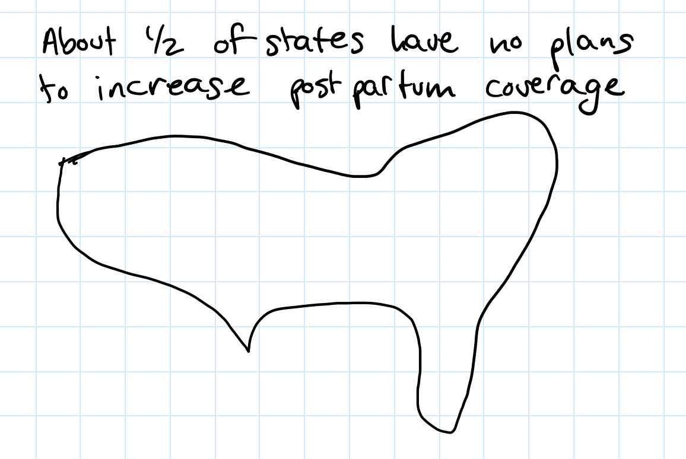
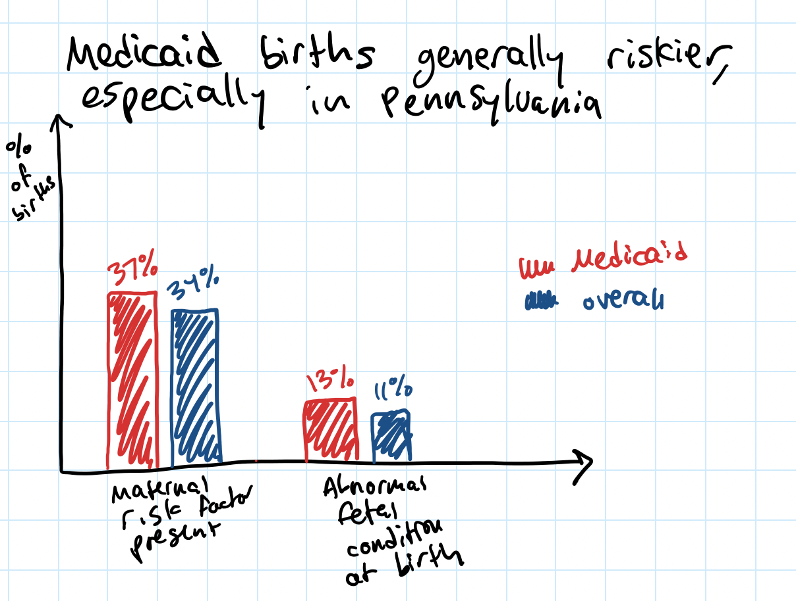
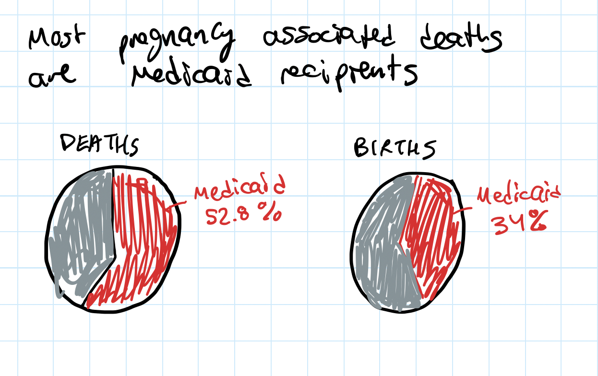
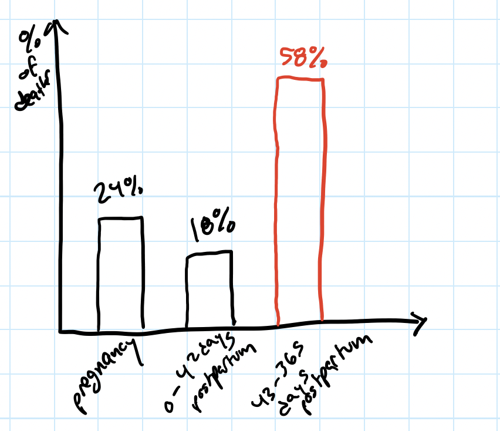

# The Importance of Medicaid Coverage for Maternal Health in the US

## Project Outline

1. Project Overview 

Between 2016 and 2020 State funded Medicaid covered 42% of births in the US.  States are required to continue coverage for 60 days, but new legislation would allow states to encourage coverage to one year post-partum.  While generally insurance coverage is associated with better health outcomes, this population in particular can benefit from the expanded coverage.  

(storyArc.jpg)

2. Current State of Coverage

3. Importance of Coverage

4. Summary and Analysis

## Planning Sketches

## Data
[Kaiser Family Foundation](/https://www.kff.org/medicaid/issue-brief/medicaid-postpartum-coverage-extension-tracker/)
Information about state by state coverage

[CDC Natality data portal](/https://wonder.cdc.gov/natality-expanded-current.html)
Data on Medicaid births, risk factors, maternal and fetal morbidity

[Pennsylvania state data](chrome-extension://efaidnbmnnnibpcajpcglclefindmkaj/viewer.html?pdfurl=https%3A%2F%2Fwww.health.pa.gov%2Ftopics%2FDocuments%2FDiseases%2520and%2520Conditions%2FPregnancy%2520Associated%2520Deaths%25202013-2018%2520FINAL.pdf&clen=834643&chunk=true)

[Michigan state data](/chrome-extension://efaidnbmnnnibpcajpcglclefindmkaj/viewer.html?pdfurl=https%3A%2F%2Fwww.michigan.gov%2Fdocuments%2Fmdhhs%2FMMMS_2012-2016_Fact_Sheet_1.23.2020_679478_7.pdf&clen=212384&chunk=true)

[Massachusetts state data](chrome-extension://efaidnbmnnnibpcajpcglclefindmkaj/viewer.html?pdfurl=https%3A%2F%2Fwww.mass.gov%2Fdoc%2F2014-report-pregnancy-associated-mortality-2000-2007%2Fdownload&clen=812805&chunk=true)
State specific data on maternal health, including post-partum mortality and morbidity information

[Health Affairs Article](https://www-healthaffairs-org.cmu.idm.oclc.org/doi/epdf/10.1377/hlthaff.2021.00730)
Information on the importance of post-partum Medicaid coverage.

## Method and Medium

I plan to use my github portfolio for my final project.  In this way I can leverage my new understanding of how to use a git-hub personal website, and keep all of my work in one place. I will create a new clean page and leverage embedding and formatting to create a comprehensible and interesting story. 
