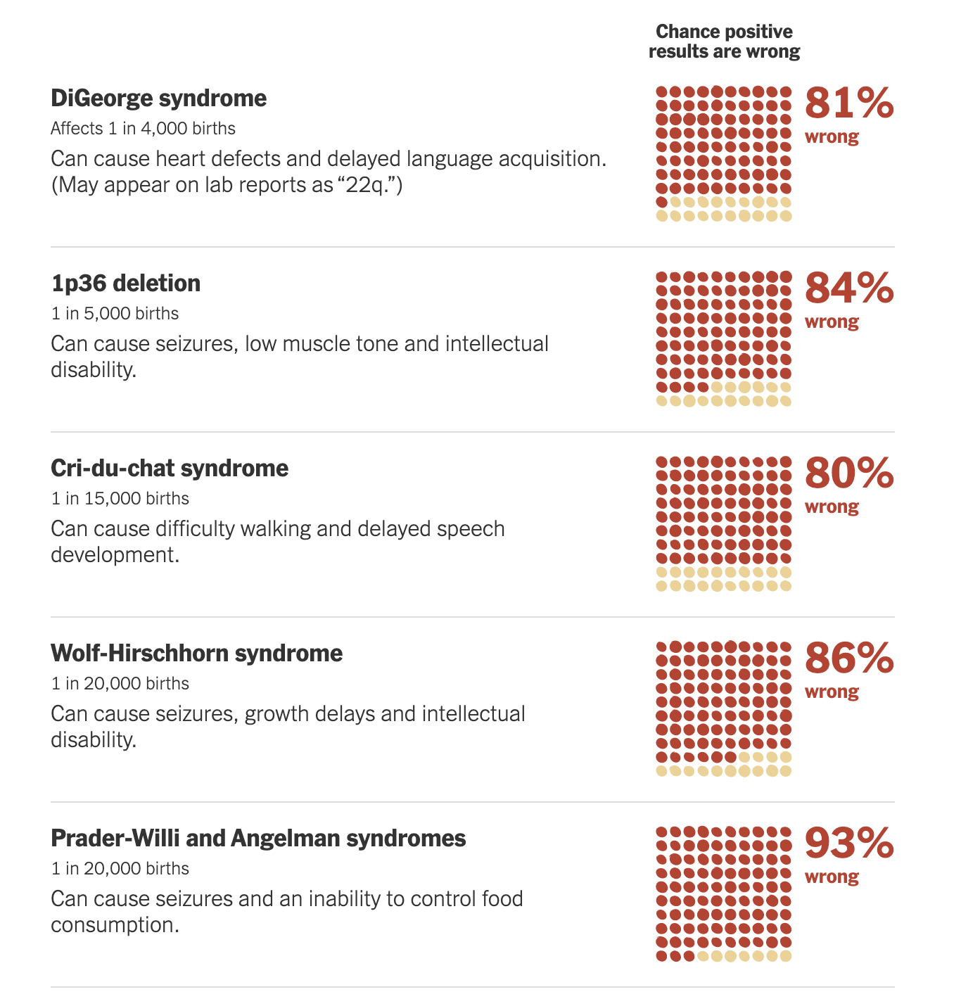
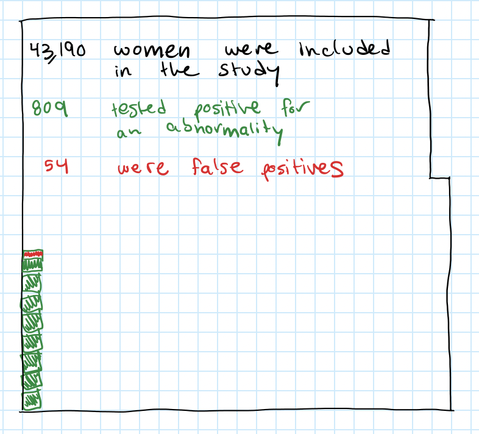

# Assignment 3: Critique by Design
## Prenatal diagnostic testing false positives

### Introduction
A recent article in the [New York Times](/https://www.nytimes.com/2022/01/01/upshot/pregnancy-birth-genetic-testing.html) highlighted a scary phenomenon - for certain prenatal tests, a positive test may not provide as certain a diagnosis as the pregnant person would be expected to believe.  The article included the below visualization:

What this visualization minimizes is the frequency with which women test positive.  It does include the prevalence of the condition, but this information is minimized by using small text and placing it far from the focal point of the visualizations which is the false positive rate.  For very rare diseases, the likelihood of having the condition is so small
that the slightly higher likelihood of testing positive is also incredibly small.  My goal for this assignment was to put the false positive rate into perspective by also including the likelihood of testing positive.

I found another discussion of prenatal testing in [this article] (/https://www.sciencedirect.com/science/article/pii/S0301211520306886?casa_token=QdMO11AX6lgAAAAA:QiQrjFcxgFzYQfPZ5IekWR6K8fi7u4fE1aQV4zyV1x9ywWidVEKPWhAe8Q35sdcKf5vlE1UYM7Y#fig0005).  Figure 1 is a consort diagram, which is intended for an academic audience that expected information to be presented in this format, but is not necessarily effective for a lay audience.  

### Wireframing
My first attempt to create a visualiation of this data that more accurately protrayed the risks of these tests was relatively simple, ineffective and focused only on the data from the journal article.

My first critique interview was with a fellow classmate, so someone who is familiar with data visualization.  I had two key learnings from our conversation:
- The lack of title was a missed opportunity to strengthen my intended point, and left the reader a bit confused as to the importance of the data
- The scale is unclear, it is not obvious that one box is equivalent to 100 people

Interestingly, she also mentioned that the red/green color scheme would be difficult for color blind people.  Rationally I was aware of this, but my instinct was still to use red for bad and green for good.  I realized the true extent of this concern in my second interview, since my interviewee was color blind and was immediately thrown by the color scheme.  His first words when looking at the visualization were "this is going to take me a second."

He also suggested I used a pie chart.  Upon further digging I realized this was because it was not obvious that the intention was to make the positive test rate look small.

### First attempt at visualization

